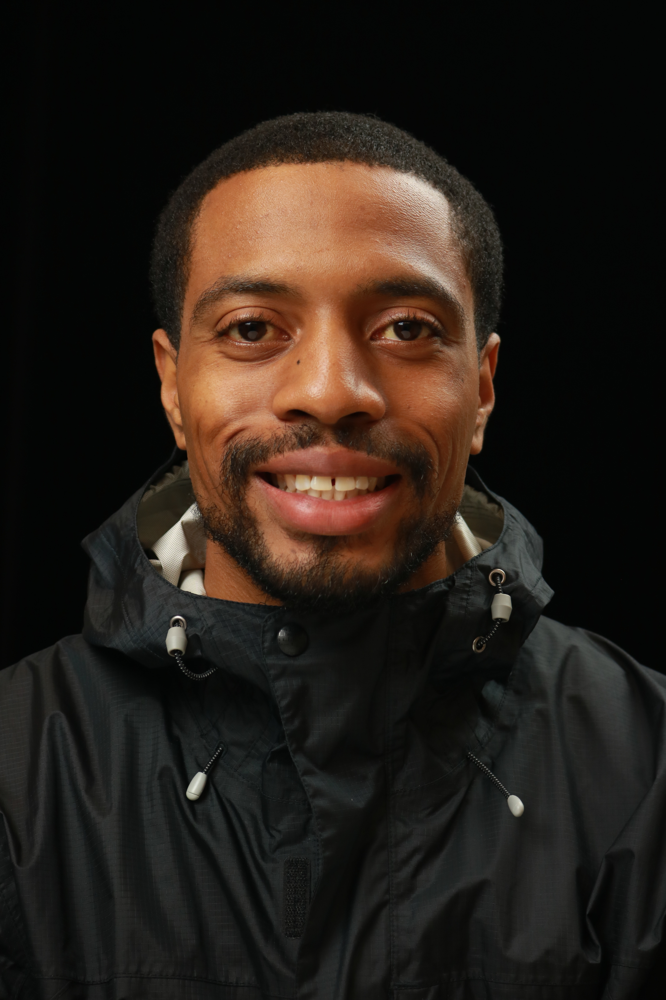

# Dan LaZenberry

## About me
New England native living in Brooklyn,NY.
My coding journey began at Columbia University, where I attended a Full-stack web development coding bootcamp.

# Get in Contact with me!
#### [LinkedIn](https://www.linkedin.com/in/daniel-lazenberry-038a14181/)
#### Email: daniel@danlaz.com
#### [Twiiter](https://twitter.com/LaZenberry_Dan)

# Resume & Portfolio Website
#### [Resume](https://danlaz.com/resume.html)
#### [danlaz.com](https://danlaz.com/)

# 
#### [StackOverFlow](https://stackoverflow.com/users/17203184/dan-lazenberry?tab=profile)
#### [CodeWars](https://www.codewars.com/users/DanLaZ)

<!--
**DanLaZ/DanLaZ** is a ✨ _special_ ✨ repository because its `README.md` (this file) appears on your GitHub profile.

Here are some ideas to get you started:

- 🔭 I’m currently working on ...
- 🌱 I’m currently learning ...
- 👯 I’m looking to collaborate on ...
- 🤔 I’m looking for help with ...
- 💬 Ask me about ...
- 📫 How to reach me: ...
- 😄 Pronouns: ...
- ⚡ Fun fact: ...
-->
